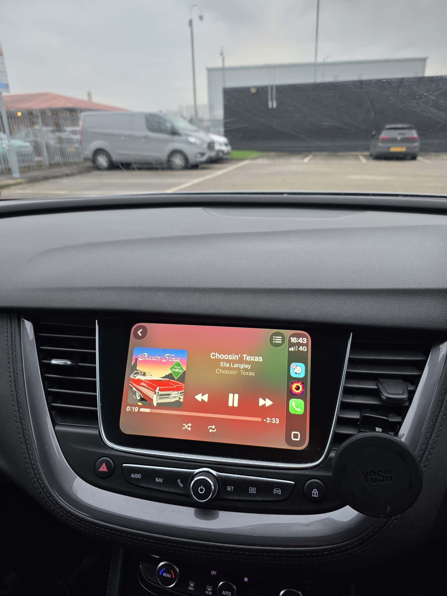

# Devices Support

This section showcases the list of devices supported by the Eclipse app and the specific features available for each. This page will be updated over time as more devices and features are added to the ecosystem.

---

## macOS Support

Eclipse features a dedicated macOS application, allowing you to enjoy all the features from the mobile version plus a few desktop-exclusive enhancements.

:::info Showcase Coming Soon
We are currently working on a video demonstration for the macOS version. Stay tuned!
:::

### Handover Mode

Seamlessly switch between your Mac and iPhone using **Handover Mode**. This allows you to transfer your current playback and music queue from one device to another so you can resume exactly where you left off.

---

## CarPlay

Take your music on the road! With **CarPlay integration**, you can listen to and control your library directly through your car's infotainment system. It supports native controls, Siri commands, and a simplified UI for safe driving.

---

## Android Support

:::note Coming Soon
An Android version of Eclipse is currently in development! We are working hard to bring the same premium experience to the Android ecosystem. Join the Discord for the latest progress updates and beta testing opportunities.
:::

---

:::tip Setup
To use Handover, ensure both your Mac and iPhone are signed into the same account and have Bluetooth enabled!
:::