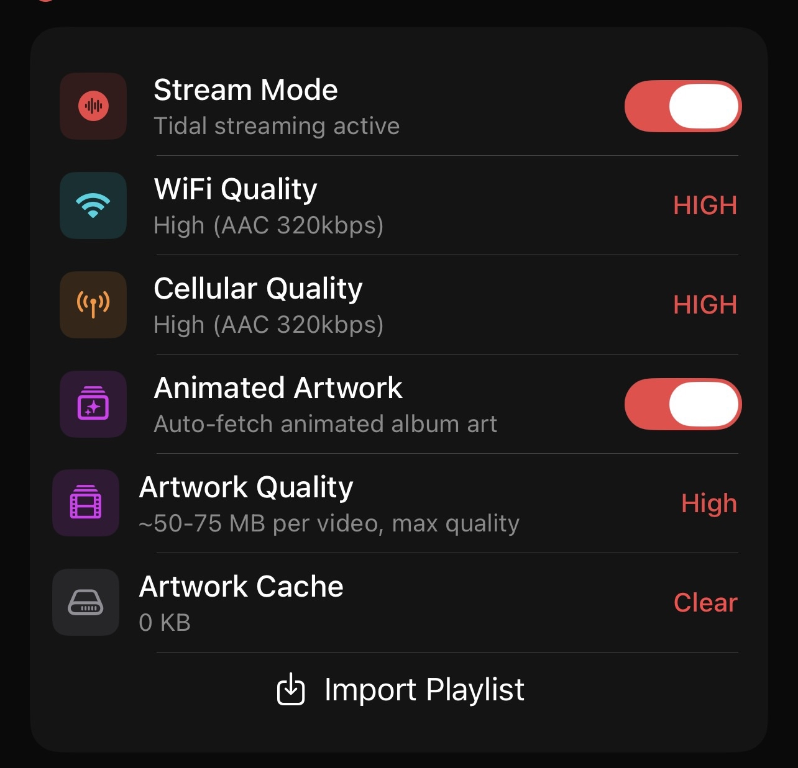
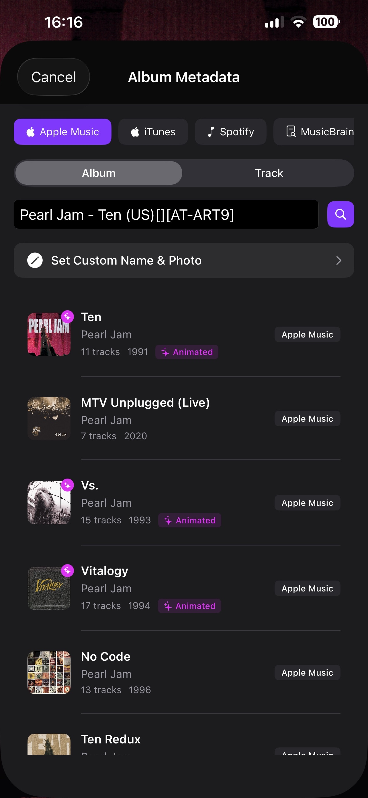
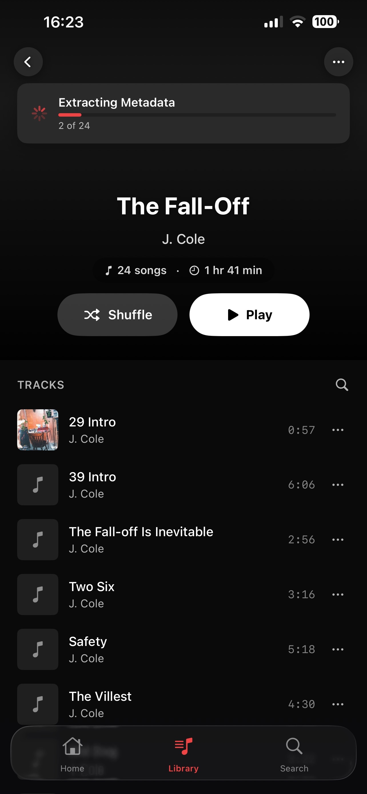
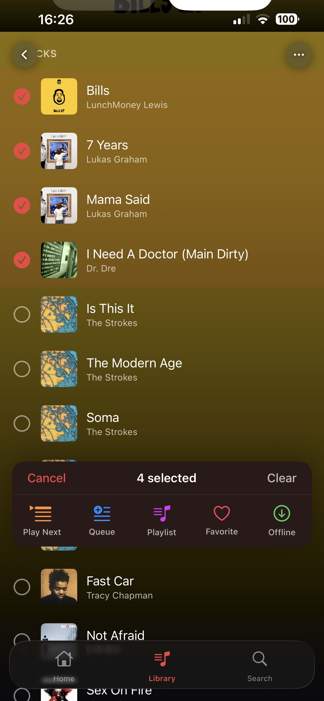
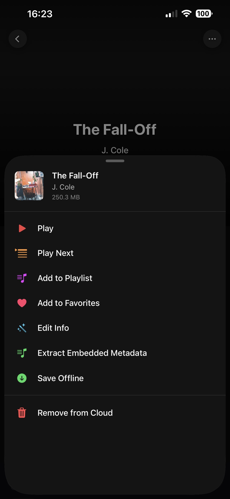

# Library & Organisation

This section lists the features relating to **library and organisation** functions within the Eclipse app. Over time, this page will be populated with future features as the app gets updated.

---

## Playlists 

The playlist feature lets you create, edit, and manage your playlists in style. You can customise the names and choose specific album art to use as the cover.

  
  

### Playlist Import from Streaming Platforms

Easily import your existing **Spotify, Apple Music, or YT Music** playlists directly into Eclipse to keep your music transition seamless.

---

## Favorites 

Quickly add music to your Favorites playlist by pressing the **heart icon** while listening to a song in your library.

---

## Edit Metadata

This feature lets you manually search for and apply metadata to specific tracks or an entire album, keeping your library perfectly organised.

---

## Extract Embedded Metadata

This feature allows you to pull and apply embedded album/track metadata, such as track names and high-quality album art, directly from your files.

---

## Auto Extract Metadata

Eclipse will automatically extract any embedded metadata for newly added tracks. This saves you the time of manually editing your library every time you add new music.

---

## Multi-selection

Need to move fast? Multi-selection lets you run functions—such as **Group**, **Add to Favorites**, or **Add to Playlist**—on multiple selected tracks at once.

---

## Quick Mix

This feature lets you instantly play and shuffle tracks from your Debrid library with a single tap.

---

## Share Track

Spread the music! You can share tracks with fellow Eclipse users to easily import and exchange music between friends.

---

:::tip Setup
If you notice any metadata isn't appearing correctly, try using the **Extract Embedded Metadata** tool to refresh the track information or use **Edit Metadata*!
:::

