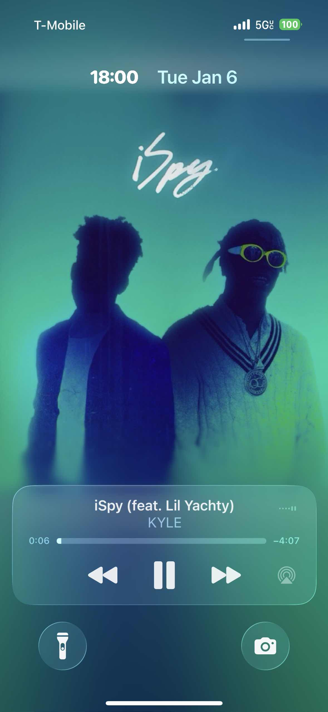
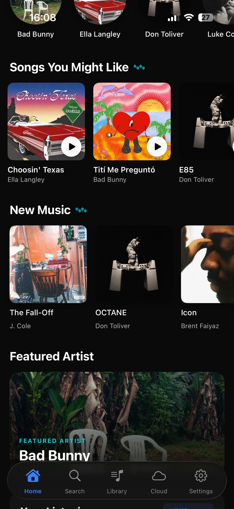

# Playback & Experience

This page lists some of the cool **playback and experience** features Eclipse currently has. Over time, this will be updated to include as many new features as possible!

<video controls width="100%" style={{ borderRadius: '10px' }}>
  <source src="/img/eclipse/features/summaryvid.mov" type="video/quicktime" />
  <source src="/img/eclipse/features/summaryvid.mov" type="video/mp4" />
  Your browser does not support the video tag.
</video>

  
  

---

## Animated Album Art

<video controls width="100%" style={{ borderRadius: '10px' }}>
  <source src="/img/eclipse/features/summaryvid.mov" type="video/quicktime" />
  <source src="/img/eclipse/features/summaryvid.mov" type="video/mp4" />
  Your browser does not support the video tag.
</video>

---

## Stream Mode

Stream mode is a feature which allows instant access to streaming music (**MP3, FLAC/Lossless**). These all act together as one ecosystem and can be put in playlists together. You can set the stream quality used over cellular & WiFi within the settings menu.

  
  

### Search & Tidal Integration

You can search from various sources including **Tidal**, as well as artist and playlist searches.

  
  

  
  

<video controls width="100%" style={{ borderRadius: '10px', marginTop: '10px' }}>
  <source src="/img/eclipse/features/animate-album-art.mov" type="video/quicktime" />
  <source src="/img/eclipse/features/animate-album-art.mov" type="video/mp4" />
  Your browser does not support the video tag.
</video>

---

## Integration with External Devices

Supports **Apple device handover** to/from iPhone and Mac. This lets you seamlessly switch which device to resume your music on while keeping your music queue intact.

### Lock Screen

Control your music from your lock screen with the ability to show the album art in full screen or as a preview.

:::tip Setup
Tap on the album art preview on your lock screen to switch to full-screen album art.
:::

---

## Discovery Features

Eclipse is jam-packed with useful features to help you discover new music. **Smart Shuffle** and **AI DJ** provide personalized suggestions to make finding your next favorite song a breeze.

### Smart Shuffle

Eclipse automatically finds and adds similar songs to your queue every few tracks, just like Spotify's Smart Shuffle. Recommended songs show a ✨ sparkle in the queue so you know which ones were added automatically.

:::tip Setup
Tap the shuffle button **twice** to enable Smart Shuffle.
:::

### AI DJ (Powered by Gemini API)

AI DJ uses the Gemini free API to recommend and play songs for you based on your recent listening history. It can recommend new tracks, deep cuts, and more!

  
  

---

## Playback Features

Below is a list of playback features Eclipse currently has. I would recommend viewing the showcase video below, which demonstrates many of these features in action.

* **Lyrics:** Includes an offset tool to match lyrics on a track-to-track basis.
* **Easter Eggs:** Look out for special Eclipse secrets on music from certain franchises!
* **Lock Screen Control:** Native playback controls and full-screen art.
* **Audio Enhancements:** Animated cover art, Equalizer, and loudness normalization.
* **Offline Mode:** Listen even without an internet connection.
* **Last.fm Scrobbling:** Keep your stats up to date.
* **Crossfade:** Smooth transitions between songs.

<video controls width="100%" style={{ borderRadius: '10px' }}>
  <source src="/img/eclipse/features/summaryvid.mov" type="video/quicktime" />
  <source src="/img/eclipse/features/summaryvid.mov" type="video/mp4" />
  Your browser does not support the video tag.
</video>

:::tip Suggestion
If there is a missing feature you would like Eclipse to have, why not leave a suggestion in the relevant channel in the **Debird Vault + Eclipse Discord**?
:::